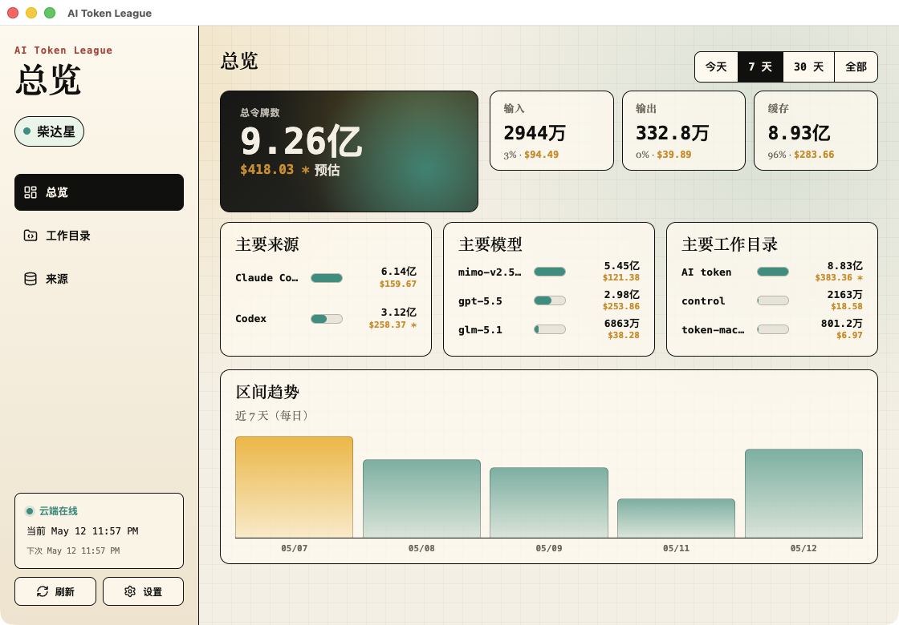
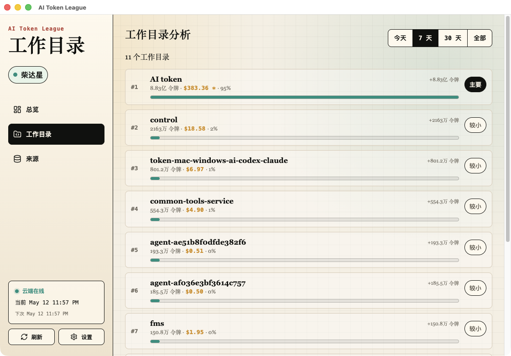
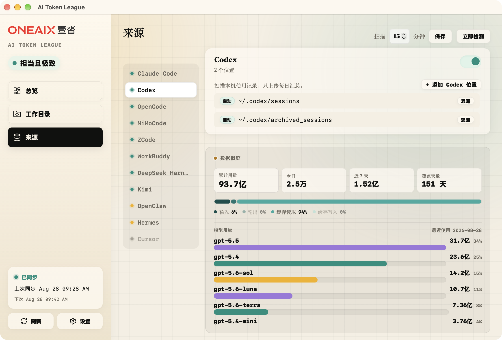
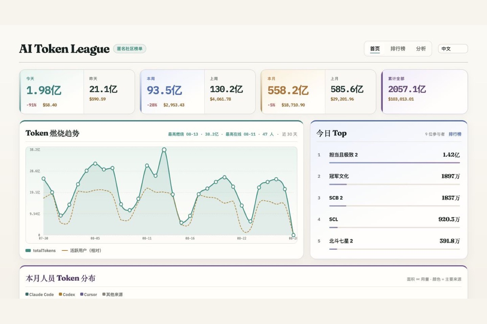
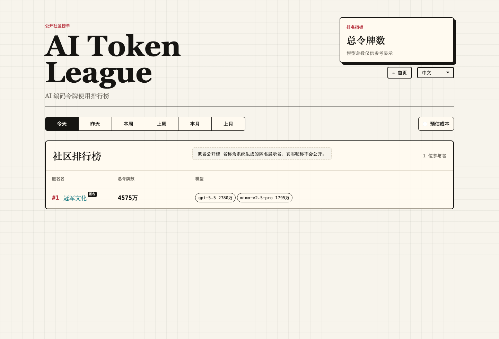
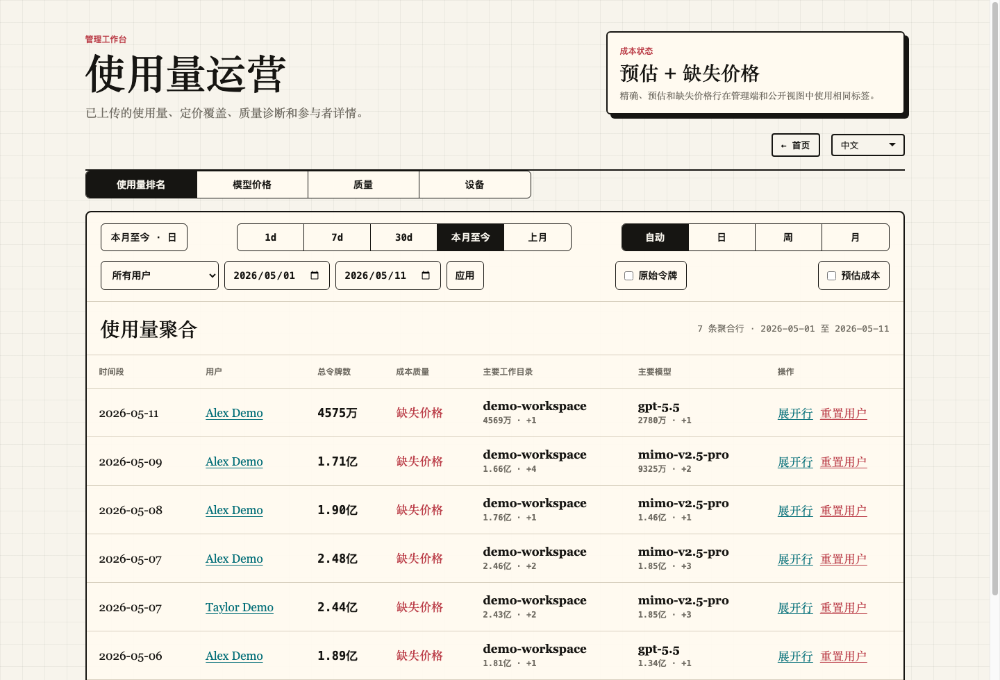
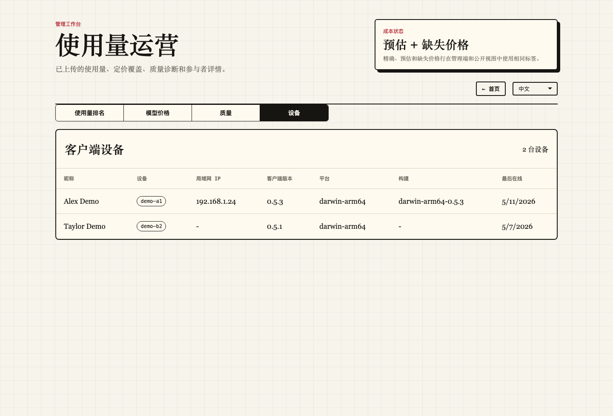

# AI Token League English · [简体中文](README.md)

[](https://github.com/SKYhuangjing/ai-token-league/releases)
[](https://github.com/SKYhuangjing/ai-token-league/releases)
[](https://github.com/SKYhuangjing/ai-token-league/issues)

A local-first AI coding token usage collector and public leaderboard for **Codex**, **Claude Code**, and **Cursor**.

> AI Token League answers a practical question: who is using AI coding tools, how many tokens they used, and how that usage is distributed across models, projects, and days. It uploads aggregate usage facts only. It does not upload prompts, assistant responses, source code, full transcripts, real absolute paths, Cursor session tokens, or identity private keys.

**Features**: Local collection · Public leaderboard · Tauri desktop app · CLI collector · Signed uploads · Token composition · OpenRouter pricing · Estimated cost · Admin console · JSON/MySQL storage · Desktop installers · Silent updates

**Officially supported platforms**: macOS Apple silicon, macOS Intel, and Windows x64.

Current version: `0.6.3-test.1`

---

## Screenshots



| Workdirs | Sources |
| --- | --- |
|  |  |

| Public Home | Community Leaderboard |
| --- | --- |
|  |  |

| Admin Usage Operations | Admin Client Devices |
| --- | --- |
|  |  |

---

## Feature Overview

### 1. Public Leaderboard

- **Public ranking**: ranks token usage across today, yesterday, this week, last week, this month, and last month.
- **Ranking truth**: the primary leaderboard metric is `totalTokens`; cost is secondary display data.
- **Participant detail**: inspect a participant's model, provider, workdir, and date breakdown.
- **Privacy-preserving display**: workdirs use hashes and display names instead of real absolute paths.

### 2. Local Collector

- **Codex local logs**: scans local Codex session JSONL logs.
- **Claude Code local logs**: scans local Claude Code project logs.
- **Cursor Dashboard Usage**: reads Cursor dashboard usage API only when explicitly enabled; Cursor does not expose local project paths.
- **Source controls**: Sources cards own provider enablement; toggles save config and do not trigger immediate scanning.
- **Multiple Cursor tokens**: stores multiple local Cursor tokens and displays account summaries.

### 3. Desktop App

- **Today**: view today's local usage, model totals, workdir totals, and last scan status.
- **Trend**: review personal Daily 30d, Weekly 12w, and Monthly 12m trends.
- **Settings**: Profile, App, Sources, Cloud, and About settings are separated by ownership.
- **First-run wizard**: new users confirm identity, privacy, sources, and cloud connection before collection starts.
- **Diagnostics export**: write a sanitized local diagnostics bundle with runtime logs, scan/sync summaries, and queue state for scan/sync/cloud reconciliation.
- **App updates**: supports manual check, checksum-verified download, restart update, and configurable silent update.

### 4. CLI Collector

- `init`: create local identity and config; first run without flags enters interactive setup.
- `health`: inspect local source, version, and server compatibility state.
- `scan`: scan local usage facts.
- `register`: register an anonymous device with the backend.
- `sync`: upload signed aggregate usage batches.
- `export-identity` / `import-identity`: migrate local identity.

### 5. Admin Console

- **Usage ranking**: query server-side aggregate usage by date, participant, and grain.
- **Model prices**: maintain custom model prices and refresh the OpenRouter price cache.
- **Missing price**: map missing display models to existing priced models.
- **Reset user**: delete one participant's server-side aggregate data during early correction windows and let the client sync again.

### 6. Release And Updates

- **Zip packages**: macOS arm64, macOS x64, and Windows x64.
- **Native installers**: macOS DMG and Windows NSIS exe.
- **Release manifest**: records platform artifacts, checksums, installer links, and protocol compatibility.
- **Cloud Connection**: desktop update checks read release config from the app-server only; the client does not embed OSS URLs.

---

## Supported Sources

| Source | Provider ID | Status | Notes |
| --- | --- | --- | --- |
| Codex | `codex_local` | Supported | Scans local Codex session JSONL logs. |
| Claude Code | `claude_code_local` | Supported | Scans local Claude Code project logs. |
| Cursor | `cursor_dashboard_usage` | Supported when enabled | Uses Cursor dashboard usage API; real project paths are unavailable. |

Token total rule:

```text
totalTokens = inputTokens + outputTokens + cacheReadTokens + cacheWriteTokens
```

Reasoning tokens are diagnostic and cost-related fields. They are not part of the main ranking total.

---

## Security And Privacy

The server receives daily aggregate usage facts only. These fields must never be uploaded:

- prompt
- assistant response
- source code
- full transcript
- real absolute path
- Cursor session token
- identity private key

Default local storage:

| Data | Default location |
| --- | --- |
| Local identity, sources, aliases, provider config | `~/.ai-token-league/config.json` |
| Local usage cache | `~/.ai-token-league/usage-cache.json` |
| Upload queue | `~/.ai-token-league/upload-queue.json` |
| Sync manifest | `~/.ai-token-league/sync-manifest.json` |
| Runtime log | `~/.ai-token-league/log/runtime.YYYY-MM-DD.log`, keeps the last 3 days by default and is sanitized in diagnostics exports |
| Backend JSON store | `data/db.json` |

Practical safety tips:

1. Do not share the `~/.ai-token-league` directory directly.
2. `Settings > About > Data Protection` enables automatic backup by default and supports Back up now, restore from backup, backup folder selection, opening the backup folder, clearing backups, and retention days. The default folder is `~/.ai-token-league/backup/`.
3. Local backup files contain sensitive recovery data and may include identity private keys and local tokens; use them only for personal migration or recovery.
4. Confirm diagnostics exports contain sanitized aggregate facts only.
5. On shared machines, remove local config and upload queue data after use.

---

## Installation

### Option A: Download Desktop Installers

Go to [GitHub Releases](https://github.com/SKYhuangjing/ai-token-league/releases) and download the installer for your system:

- **macOS Apple silicon**: `AI Token League-0.6.3-test.1-mac-arm64-installer.dmg`
- **macOS Intel**: `AI Token League-0.6.3-test.1-mac-x64-installer.dmg`
- **Windows x64**: `AI Token League-0.6.3-test.1-win-x64-installer.exe`

### Option B: Download Zip Packages

You can also download and run zip packages:

- `AI Token League-darwin-arm64.zip`
- `AI Token League-darwin-x64.zip`
- `AI Token League-win32-x64.zip`

### macOS Cannot Open The App Or Says It Is Damaged?

If macOS blocks the app as coming from an unidentified developer, refuses to open it, or says the app is damaged, open it from System Settings > Privacy & Security. If needed, remove the quarantine flag:

```bash
sudo xattr -rd com.apple.quarantine "/Applications/AI Token League.app"
```

---

## Quick Start

Requirements:

```text
Node.js >= 22
```

Install dependencies:

```bash
npm install
```

Start the backend and public Web leaderboard:

```bash
[ -f env.local ] || cp env.example env.local
scripts/start-server.sh --env env.local
```

Open:

```text
http://127.0.0.1:8787
```

Initialize the local collector:

```bash
npm run collector:init -- --nickname your-name --api http://127.0.0.1:8787
```

Scan and sync:

```bash
npm run collector -- scan
npm run collector -- sync
```

Run the desktop app:

```bash
npm run desktop
```

---

## Development And Build

Project scripts are the preferred entrypoints for service and release workflows:

- Start service: `scripts/start-server.sh --env env.local`
- Build/release: `scripts/release.sh`
- Bump client version or product baseline: `npm run bump -- <version>` or `npm run bump -- --baseline <major.minor>`
- Generate build preset: `npm run preset -- --env env.local`
- Release manifest dry run: `node scripts/publish-release.js --env env.local --dry-run`

`npm start`, `npm run package:*`, and `npm run release:*` are low-level commands for targeted verification or debugging. Prefer the script entrypoints for normal service startup and full release work.

Common checks:

```bash
npm test
npm run smoke
npm run desktop
```

Ordinary desktop UI or renderer changes use `npm run desktop` by default and do not require rebuilding a package. Build exactly one zip for the current machine only when the change can differ in the packaged runtime: desktop package resources, bundled assets, presets, update/release metadata, install, or download UX. The script detects the platform:

```bash
scripts/release.sh --platform current --env env.local --yes
```

Build packages:

```bash
scripts/release.sh --platform current --yes
scripts/release.sh --platform all --yes
```

Release dry run:

```bash
node scripts/publish-release.js --env env.local --dry-run
```

Full release:

```bash
scripts/release.sh --env env.local --upload --yes
```

Developer commands, API details, storage notes, and verification boundaries live in [AGENTS.md](AGENTS.md).

---

## Project Docs

- [CHANGELOG.md](CHANGELOG.md) - English changelog.
- [CHANGELOG.zh-CN.md](CHANGELOG.zh-CN.md) - Chinese changelog.
- [doc/0.7-baseline.md](doc/0.7-baseline.md) - 0.7 desktop client UI redesign baseline (active).
- [doc/0.7-development-tasks.md](doc/0.7-development-tasks.md) - 0.7 complete implementation tasks and verification record.
- [doc/0.6-baseline.md](doc/0.6-baseline.md) - 0.6 product baseline (frozen).
- [doc/0.6-development-tasks.md](doc/0.6-development-tasks.md) - 0.6 development tasks and verification record.
- [doc/0.5-baseline.md](doc/0.5-baseline.md) - 0.5 product baseline (frozen).
- [doc/0.5-development-tasks.md](doc/0.5-development-tasks.md) - 0.5 development tasks and verification record.
- [doc/0.4-baseline.md](doc/0.4-baseline.md) - 0.4 product baseline.
- [doc/0.4-development-tasks.md](doc/0.4-development-tasks.md) - 0.4 development tasks and verification record.
- [doc/0.3-baseline.md](doc/0.3-baseline.md) - 0.3 product baseline.
- [doc/0.3-development-tasks.md](doc/0.3-development-tasks.md) - 0.3 development tasks and verification record.
- [doc/0.2-baseline.md](doc/0.2-baseline.md) - 0.2 product baseline.
- [doc/v0.1-baseline.md](doc/v0.1-baseline.md) - Frozen 0.1 MVP baseline.
- [doc/er-diagram.md](doc/er-diagram.md) - Local and remote storage model diagrams.
- [doc/usage-composition-design.md](doc/usage-composition-design.md) - Token and cost composition design.
- [doc/openrouter-pricing-design.md](doc/openrouter-pricing-design.md) - OpenRouter pricing design.
- [doc/packaging.md](doc/packaging.md) - Desktop packaging and verification.
- [doc/operations.md](doc/operations.md) - Operations manual: server deployment, download channel configuration, and client preset setup.
- [doc/test-deployment.md](doc/test-deployment.md) - Docker and MySQL test deployment.

---

## Current Limits

- No hook-based live collection yet.
- No account system, team room, or private board yet.
- Cost is optional display, not the main ranking metric.
- Cursor dashboard usage does not provide local workdir attribution.
- Windows has passed initial usability verification, but real Windows verification should be repeated after packaging or updater changes.
---
