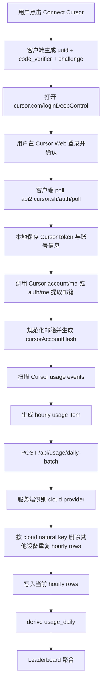
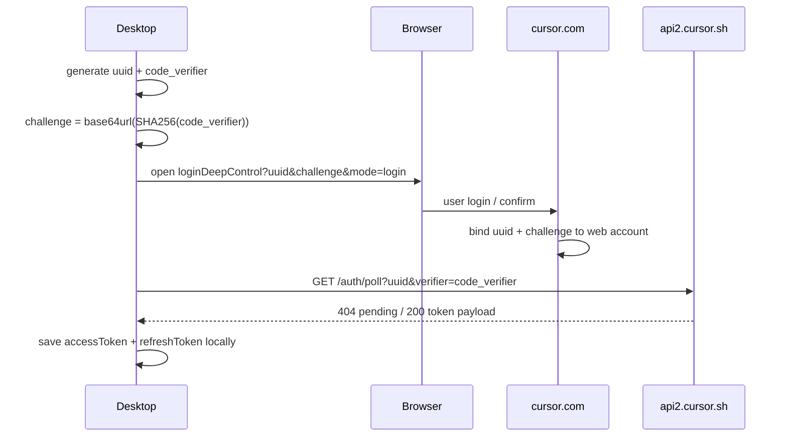
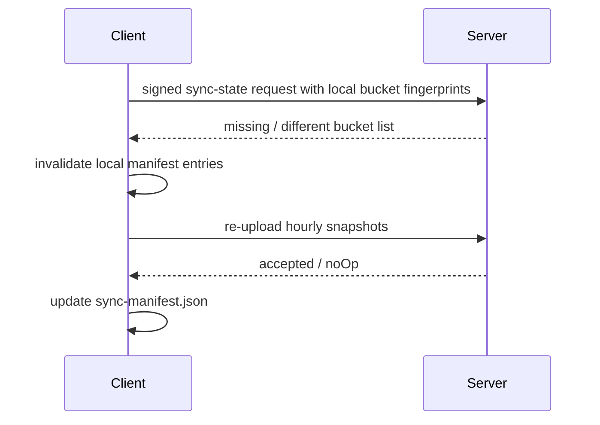

# 多设备 Cursor 云端数据去重设计

## Review Surface

### 目标

支持同一用户在多台电脑安装客户端后，服务端能正确聚合同一 `participantId` 的多设备数据：Codex / Claude Code 本地日志按设备累加；Cursor Dashboard Usage 来自 Cursor 云端，同一 Cursor 账号在多设备上报时只能计一次。

本方案以当前版本的 hourly snapshot 上传为权威写入面：`snapshot.mode = device_day_hour_provider`。历史重复数据不通过细粒度 repair 兜底，改由云端 reset + 本地 sync-state 核对 / 重传闭环修正。

### 成功标准

| 场景 | 成功标准 |
|---|---|
| 同一用户多设备 Cursor 同账号 | 同一 `participantId + day + hour + model + Cursor账号` 只保留一份用量 |
| 同一用户多设备本地 provider | Codex / Claude Code 不去重，按设备累加 |
| 云端 reset 后本地仍标记已上传 | 客户端能发现服务端缺 bucket，并重新上传真实 hourly snapshot |

### 方案判断

| 结论 | 判断 |
|---|---|
| 用 Cursor 登录邮箱作为去重身份 | 合理，但只能作为 hash 输入，不能把 token/cookie 上传到服务端 |
| 用浏览器授权取代 Add Cursor Token | 合理；主入口改为 `Connect Cursor`，客户端生成 `uuid/challenge`，用户在 Cursor Web 确认后本地轮询拿 token |
| Cursor 账号自动刷新 | 必须补；当前 token 失效会静默漏采，Connect Cursor 落地时要同时保存 refresh token 并在扫描前刷新 |
| 不考虑 daily 合并 | 当前版本可接受，前提是版本边界明确为 hourly-only；legacy daily 只能作为兼容路径，不作为本次主链路 |
| 用云端 reset 替代历史 repair | 可接受，但必须同步解决本地 manifest 失真，否则 reset 后客户端会 no-op |
| 只在服务端写入时 dedup | 不完整；还需要客户端账号身份稳定化和 reset 后 sync-state 核对 |

### 本次做 / 不做

| 类型 | 内容 |
|---|---|
| 本次做 | `Connect Cursor` 浏览器授权、Cursor token refresh / reauth 状态、Cursor 账号身份稳定化、hourly 写入跨设备去重、daily derived 只来自去重后的 hourly、云端 reset 后的 sync-state 核对 |
| 本次不做 | 不新增 daily snapshot 合并主链路；不再把手动 `Add Cursor Token` 作为主入口；不把 Cursor token、cookie、原始 auth 响应上传服务端 |
| 不放宽 | 排行榜仍按 `totalTokens`；服务端仍不得接收 prompt、response、源码、真实路径、Cursor session token、identity private key |
| 必须复用 | `POST /api/usage/daily-batch`、hourly snapshot、`usage_hourly`、`usage_daily` derived serving table、`sync-manifest.json` |
| 前置阻断 | 未实测 `auth/poll` 与 `oauth/token` 的 request/response 前，不进入正式实现 |

## 现状与边界

### 现状

- 当前客户端按 `day + hour + providerId` 分 bucket 上传 `device_day_hour_provider` snapshot。
- `usageKey` / `hourlyUsageKey` 包含 `deviceId`，这对本地 provider 是正确的。
- Cursor provider 当前用 `virtual:cursor-dashboard:Cursor · <account_name>` 生成虚拟 workdir，再由 `workdir_from_candidate()` 结合 `participantId` 生成 `workdirHash`。
- Cursor 配置当前以本地 token / cookie 输入为主，用户需要手工复制敏感材料，体验和安全边界都不理想。
- 当前 Cursor token 没有自动刷新：手动 token 只保存 token/accountName，扫描失败时会跳过 Cursor source，UI 不一定显示账号已失效。
- `sync-manifest.json` 只记录本地认为已成功上传的 bucket fingerprint；如果云端数据被 reset，本地 manifest 不会自动失效。

### 根因

Cursor Dashboard Usage 是云端账号级事实，不是设备级事实。多台设备用同一个 Cursor 账号拉到同一批云端事件，如果服务端按 `deviceId` 分行存储并聚合，就会重复计数。

### 边界确认

当前版本只要求 hourly 上传链路正确。因此本次去重的事实源是：

```text
participantId + day + hour + providerId + toolCode + cursorAccountHash + model
```

不是：

```text
participantId + deviceId + day + hour + providerId + workdirHash + model
```

## 主链路与规则视图



### 规则卡：Cursor Cloud Natural Key

| 项 | 规则 |
|---|---|
| 输入事实 | `providerId=cursor_dashboard_usage`、Cursor 登录邮箱、`participantId`、`day`、`hour`、`toolCode`、`model` |
| 派生值 | `cursorAccountHash = sha256("cursor-dashboard:" + normalizedEmail + ":" + participantId)` |
| 判定顺序 | 仅 cloud provider 进入该规则；本地 provider 直接跳过 |
| 不命中反例 | `providerId=codex_local` / `claude_code_local`；Cursor 未取到邮箱且无稳定 user id |
| 命中动作 | 删除同一 cloud natural key 下其他 `deviceId` 的 `usage_hourly` 行，再写入当前行 |
| 修复动作 | 云端 reset 后通过 sync-state 核对缺失 bucket 并重传 |
| 关联验证 | 多设备 Cursor 同账号只计一次；不同 Cursor 账号不互删；本地 provider 不受影响 |

### 去重矩阵

| Provider | 多设备同账号 / 同 workdir | 多设备不同账号 / 不同 workdir | 处理 |
|---|---:|---:|---|
| `cursor_dashboard_usage` | 去重 | 保留 | 云端账号事实，跨设备重复 |
| `codex_local` | 保留 | 保留 | 本地日志事实，设备之间应累加 |
| `claude_code_local` | 保留 | 保留 | 本地日志事实，设备之间应累加 |

## Detail Blocks

### Cursor 浏览器授权登录

用 `Connect Cursor` 取代现有 `Add Cursor Token` 主入口。流程参考 Cursor deep login：



本地状态：

| 字段 | 规则 |
|---|---|
| `uuid` | 每次连接生成，作为本次登录会话 id |
| `codeVerifier` | 本地随机值，只保存在内存 pending state |
| `challenge` | `base64url(SHA256(codeVerifier))`，放入浏览器 URL |
| `expiresAt` | 默认 5 分钟，过期后必须重新发起 |
| `poll interval` | 默认 2 秒；`404` 表示用户未完成确认，继续等待 |

成功响应只允许写入本地配置，不进入 `/api/usage/daily-batch`。手动粘贴 token / cookie 入口降级为故障 fallback，可隐藏到高级设置，不作为普通用户主路径。

实现前置实测：

| 接口 | 必须确认 | 未确认时处理 |
|---|---|---|
| `GET https://api2.cursor.sh/auth/poll?uuid=<uuid>&verifier=<codeVerifier>` | pending 状态码、成功字段名、失败字段名、过期行为 | 停止实现，仅保留文档待确认 |
| `POST https://api2.cursor.sh/oauth/token` | payload 形状、`client_id`、是否 JSON、是否返回新 `refresh_token`、`shouldLogout` 语义 | 停止 refresh 实现，不允许用猜测字段落代码 |
| 账号信息接口 | poll 响应是否含 `email`；若不含，哪个接口可稳定取得邮箱 | 未确认时只能使用 `authId` hash，不展示邮箱 |

本地持久化字段：

| 字段 | 规则 |
|---|---|
| `accessToken` | Cursor API bearer token；只保存在本机 |
| `refreshToken` | 用于刷新 access token；只保存在本机 |
| `authId` | Cursor / WorkOS 用户标识；用于 fallback 身份 hash |
| `email` | 仅用于本地展示和生成 `cursorAccountHash` |
| `accessTokenExpiresAt` | 从 JWT `exp` 解析；缺失时按 `lastRefreshAt` + 默认 TTL 保守处理 |
| `lastRefreshAt` | 最近一次 refresh 成功时间 |
| `authStatus` | `active` / `refresh_failed` / `reauth_required` |

本地存储和清理边界：

| 对象 | 规则 |
|---|---|
| 配置结构 | 新增 `cursorDashboardUsage.accounts[]` 承载授权账号；旧 `workosSessionTokens` 只作为 legacy fallback |
| 诊断导出 | 只导出账号数、masked email、`authStatus`、`lastRefreshAt`；不得导出 token 字段 |
| runtime log | 不打印 token、完整邮箱、原始响应；只打印 account hash 和状态 |
| 本地 reset | 清理授权账号、legacy token、sync manifest、upload queue |
| backup / restore | backup 若包含账号配置，必须 redacted；restore 不恢复真实 token |

auto-detect 关系：

| 来源 | 规则 |
|---|---|
| `Connect Cursor` 授权账号 | 主配置来源，拥有 refresh / reauth 生命周期 |
| Cursor 本机 `state.vscdb` 自动检测 | 辅助来源，只用于发现本机 Cursor 登录态；不覆盖授权账号 token 链 |
| auto-detect 与授权账号同账号 | 合并为一个 account/workdirHash；优先使用授权账号 token |
| auto-detect token 失效 | 不进入 `reauth_required`；仅显示本机 Cursor 登录态不可用 |
| legacy 手动 token | 高级 fallback；不参与自动 refresh，失效后提示改用 `Connect Cursor` |

### Cursor 账号身份

浏览器授权成功后，客户端用本地 token 调用 Cursor 账号接口获取登录邮箱。优先使用能返回邮箱的账号接口；如果 `api2.cursor.sh/auth/poll` 响应已包含 email，可直接使用该值，否则再调用 Cursor Web 账号接口。

处理规则：

| 字段 | 规则 |
|---|---|
| 登录邮箱 | 从响应中提取，trim + lowercase；只作为 hash 输入 |
| `cursorAccountHash` | `sha256("cursor-dashboard:" + normalizedEmail + ":" + participantId)` |
| `workdirCandidate` | `virtual:cursor-dashboard:<cursorAccountHash>` 或等价稳定虚拟 key |
| `workdirDisplayName` | 可继续显示 `Cursor · <email>`；若后续收紧隐私，可改为 `Cursor · <masked email>` |
| fallback | 如果邮箱不可得，可退回稳定 `auth_id` / user id hash；不能退回设备相关字段 |

注意：Cursor access token、refresh token、Cookie、Workos token、原始 auth 响应都不得进入上传 payload、日志和诊断导出。

### Cursor token refresh

Connect Cursor 必须同时交付 refresh 闭环，否则 token 失效后会漏采 Cursor 云端数据。

刷新触发：

| 时机 | 动作 |
|---|---|
| scan 前 | 如果 `accessTokenExpiresAt` 距当前小于 5 分钟，先 refresh 再请求 usage |
| usage API 返回 `401` / `403` | 立即 refresh 一次，并重试当前 Cursor usage 请求一次 |
| refresh 失败 | 标记账号 `reauth_required`，本轮不再继续请求 Cursor usage |
| 用户点击重新连接 | 重新走 `Connect Cursor`，成功后替换该账号 token 链 |

刷新接口候选：

```http
POST https://api2.cursor.sh/oauth/token
Content-Type: application/json

{
  "grant_type": "refresh_token",
  "client_id": "KbZUR41cY7W6zRSdpSUJ7I7mLYBKOCmB",
  "refresh_token": "<local refresh token>"
}
```

成功响应候选：

```json
{
  "access_token": "<new access token>",
  "id_token": "<id token>",
  "shouldLogout": false
}
```

失效响应候选：

```json
{
  "access_token": "",
  "id_token": "",
  "shouldLogout": true
}
```

实现约束：

| 约束 | 说明 |
|---|---|
| 私有接口 | `api2.cursor.sh/oauth/token` 属于非公开协议，必须保留 `Connect Cursor` reauth fallback |
| refresh token rotation | 如果响应返回新的 `refresh_token`，必须原子替换本地旧值；如果没有返回，保留旧值 |
| 并发控制 | 同一 Cursor account 同时只允许一个 refresh；其他 scan 等待结果 |
| 重试上限 | 同一请求最多 `refresh + retry usage` 一次，避免 401 循环 |
| 状态回写 | refresh 成功后更新 `accessToken`、`accessTokenExpiresAt`、`lastRefreshAt`、`authStatus=active` |
| 失败可见 | `shouldLogout=true`、401/403、网络连续失败都要进入 health 状态，不得静默吞掉 |

账号状态映射：

| 状态 | 含义 | UI / 行为 |
|---|---|---|
| `active` | token 可用 | 正常扫描和上传 |
| `refresh_failed` | 网络或临时错误导致 refresh 未完成 | 本轮跳过 Cursor，保留 token，下次重试 |
| `reauth_required` | refresh token 失效或 Cursor 要求 logout | Sources 显示 `Reconnect Cursor`，用户重新授权 |

### 服务端 hourly 去重

新增 cloud provider 集合：

```js
CLOUD_PROVIDER_IDS = new Set(["cursor_dashboard_usage"])
```

服务端处理 `upsertHourlySnapshotBatch()` 时：

1. 规范化 incoming items。
2. 对 cloud provider 构造 cloud natural key：
   ```text
   participantId | day | hour | toolCode | providerId | workdirHash | model
   ```
   其中 Cursor 的 `workdirHash` 必须来自账号 hash，而不是设备或本地路径。
3. 只删除同一 natural key 且 `deviceId != input.deviceId` 的 `usageHourly` 行。
4. 当前设备自身 stale rows 仍交给现有 bucket replace 逻辑处理，不能由 cloud dedup 扩大删除范围。
5. 写入当前设备 hourly rows。
6. 从去重后的 hourly rows derive daily rows。

删除边界：

| 条件 | 行为 |
|---|---|
| `participantId/day/hour/toolCode/providerId/workdirHash/model` 全相同且其他 `deviceId` | 删除旧 hourly row |
| 同一设备同 bucket 缺失 row | 由 `deleteHourlyBucketUsageRows()` 处理 |
| 不同 hour / model / Cursor account | 不删除 |
| 本地 provider | 不进入 cloud dedup |

当前 MySQL hourly 路径会走 `syncAllTables()`，可以先保证正确性。若后续优化成增量同步，必须把被 dedup 删除的 hourly/daily keys 带入 MySQL 事务显式删除。

### daily 边界

本次不把 daily snapshot 合并作为主链路，原因：

- 当前版本上传基线是 `device_day_hour_provider`。
- `usage_daily` 是 serving table，应由 hourly derive。
- 修 daily snapshot 不能解决云端 reset 后本地 manifest no-op 的根因。

兼容要求：

| 情况 | 处理 |
|---|---|
| 新版本 hourly 客户端 | 完整支持 Cursor 跨设备去重 |
| legacy daily 客户端 | 保持兼容，但不作为本次验收主链路 |
| 服务端仍允许 daily Cursor 上传 | 需要明确风险：旧客户端仍可能产生重复；正式发布前要么版本门禁，要么补最小 daily cloud dedup |

### 云端 reset 与 sync-state 核对

云端 reset 可以替代历史 repair，但不能单独成立。原因是本地 `sync-manifest.json` 仍记录旧 bucket fingerprint，下一次同步会认为 bucket 已上传并跳过。

必须新增一个核对机制：



推荐接口：

```text
POST /api/usage/sync-state
```

请求必须签名，签名范围与 `/api/usage/daily-batch` 一致，最小字段：

| 字段 | 说明 |
|---|---|
| `participantId` | 当前用户 |
| `deviceId` | 当前设备 |
| `clientGeneratedAt` | 请求生成时间 |
| `buckets[]` | 本地 manifest 中的 `day/hour/providerId/fingerprint` |
| `signature` | identity private key 签名 |

响应：

| 字段 | 说明 |
|---|---|
| `missing[]` | 服务端不存在，需要本地重传 |
| `different[]` | 服务端 fingerprint 不一致，需要本地重传 |
| `matched[]` | 服务端已存在，可继续 no-op |

服务端比对口径：

| 项 | 规则 |
|---|---|
| 比对表 | 当前版本只比 `usage_sync_buckets_hourly` |
| key | `participantId + deviceId + day + hour + providerId` |
| 语义 | 判断“该设备的 bucket 是否已被服务端确认接收”，不是判断最终 leaderboard 是否仍保留该设备的 usage row |
| Cursor dedup 后其他设备 usage 被删 | 不删除其 sync bucket；避免被删设备反复重传同一云端事实 |
| 云端 reset | reset 必须删除 usage rows 和 sync bucket；客户端下一次 sync-state 才能得到 `missing` 并重传 |

触发时机：

| 时机 | 规则 |
|---|---|
| 云端 reset 成功后 | 立即清空对应 server URL 的本地 manifest，下一次全量重传 |
| 普通同步前 | 每天或每 N 次 sync 对最近 35 天 hourly bucket 做一次 sync-state 核对 |
| 队列重放后 | 上传成功才更新 manifest；失败继续留在 queue |

## 验证与可观察性

| 覆盖组 | 验证入口 | 必验证据 |
|---|---|---|
| Cursor 同账号多设备 | Store / HTTP API case | `usage_hourly` 同 natural key 只剩 1 行，leaderboard 不翻倍 |
| Cursor 不同账号 | Store / HTTP API case | 不同 `cursorAccountHash` 都保留 |
| 本地 provider 多设备 | Store / HTTP API case | Codex / Claude 同 day/hour/model 均累加 |
| Cursor dedup 与 sync bucket | HTTP API case | A 设备 usage 被 B 设备同账号覆盖后，A 的 hourly sync bucket 保留，不触发反复重传 |
| auto-detect 与 Connect Cursor 同账号 | mocked scan case | 只生成一个 Cursor account/workdirHash，优先使用授权账号 token |
| 云端 reset 后重传 | API + 本地 sync manifest case | reset 后 sync-state 返回 missing，本地清 manifest 并重新上传 |
| 浏览器授权登录 | Desktop command / mocked HTTP case | 生成 `uuid/challenge`，轮询 pending/成功/过期/取消分支正确 |
| token refresh 成功 | mocked HTTP case | scan 前过期 token 调用 `/oauth/token`，更新本地 token 后继续 usage 请求；未返回新 refresh token 时保留旧值 |
| reactive refresh 成功 | mocked HTTP case | usage 401 后 refresh 成功并重试一次，最终不进入失败态 |
| token refresh 失败 | mocked HTTP case | `shouldLogout=true` 或 401/403 后账号进入 `reauth_required`，UI 显示重新连接 |
| 隐私边界 | payload / diagnostics grep | 不出现 access token、refresh token、Cookie、Workos token、原始 auth 响应、真实路径 |
| MySQL 持久化 | MySQL reload case | 服务重启 / `load()` 后重复 Cursor 行不反弹 |

可观察性最小要求：

- 客户端日志只记录 `providerId`、bucket key、rowCount、fingerprint 前缀、sync-state 结果数量。
- refresh 日志只记录 account hash、状态码、`shouldLogout`、是否重试；不记录 access / refresh token。
- 服务端日志只记录 `participantId`、`deviceId`、`providerId`、deleted count、accepted count。
- 不记录 Cursor 邮箱明文到日志；若 UI 继续展示邮箱，日志仍使用 hash 或 masked 值。

## 兼容性 / 发布 / 待确认

### 发布策略

| 阶段 | 动作 |
|---|---|
| 代码发布 | 先发客户端账号 hash + 服务端 hourly dedup + sync-state |
| 数据修正 | 对受影响用户执行云端 reset，或由用户触发 local+cloud reset |
| 客户端恢复 | reset 后清空对应 server URL 的 `sync-manifest.json` bucket，重新上传 hourly snapshot |
| 观察 | 对 leaderboard、usage quality、sync-state missing count 做发布后核对 |

### 待确认项

| 问题 | 默认建议 |
|---|---|
| Cursor deep login 私有接口稳定性 | 保留手动 token / cookie 作为高级 fallback，但 UI 主入口改为 `Connect Cursor` |
| `api2.cursor.sh/auth/poll` 响应字段名 | 实测确认 `access_token`、`refresh_token`、`auth_id`、`email`；实现时做窄字段解析，不保存完整响应 |
| `api2.cursor.sh/oauth/token` refresh 协议 | 实测确认 JSON payload、`client_id`、`shouldLogout`、是否返回新 `refresh_token` |
| access token 过期时间 | 优先解析 JWT `exp`；如果无法解析，按 55 分钟保守 TTL 并依赖 401/403 reactive refresh |
| `/api/auth/me` 响应字段名 | 仅在 poll 响应不含 email 时调用；实现时做窄字段解析，不保存完整响应 |
| 邮箱是否允许展示 | 当前沿用 `Cursor · <email>`；如果要收紧隐私，displayName 改 masked email，hash 不变 |
| legacy daily 客户端是否仍活跃 | 如果仍允许同步 Cursor daily，需要补最小 daily cloud dedup 或版本门禁 |
| sync-state 核对窗口 | 默认最近 35 天，覆盖 Cursor 当前月 usage 拉取范围和跨月边界 |

## 输出检查清单

- [x] 目标、边界、主链路、核心规则可在 Review Surface 核对。
- [x] 明确本版本 hourly-only，不把 daily repair 当主路径。
- [x] 明确云端 reset 后本地 manifest 必须失效或核对。
- [x] 明确 Cursor 主入口改为浏览器授权，不再要求普通用户手动 Add Cursor Token。
- [x] 明确 Cursor token refresh 和 reauth 状态闭环。
- [x] 明确本地凭据存储、诊断导出、reset、backup 边界。
- [x] 明确 auto-detect、legacy token 与 Connect Cursor 的优先级。
- [x] 明确 cloud dedup 删除范围和 sync-state 比对口径。
- [x] 明确 Cursor 邮箱只作为 hash 输入，不上传 token/cookie/auth raw。
- [x] 明确本地 provider 多设备累加不变。
