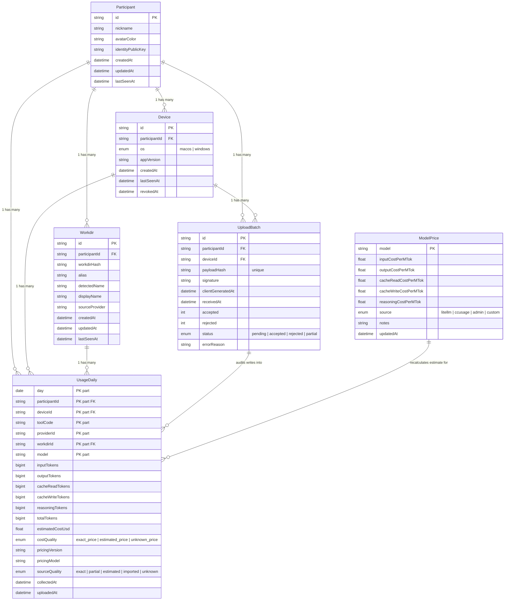
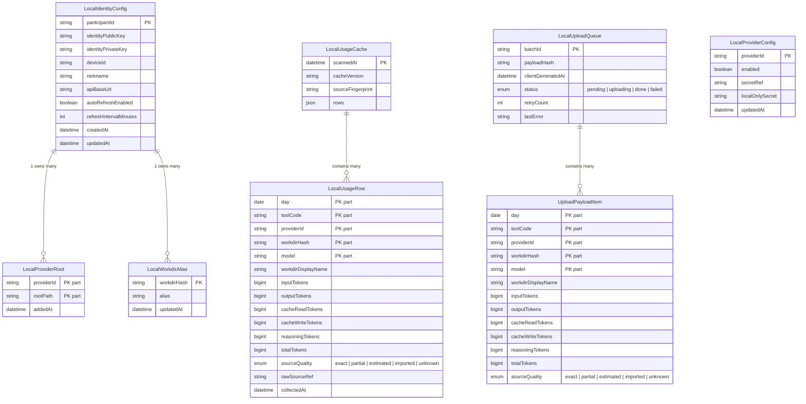
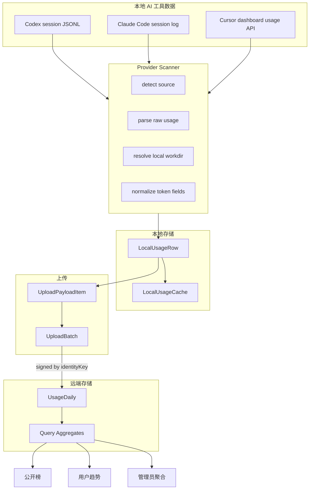
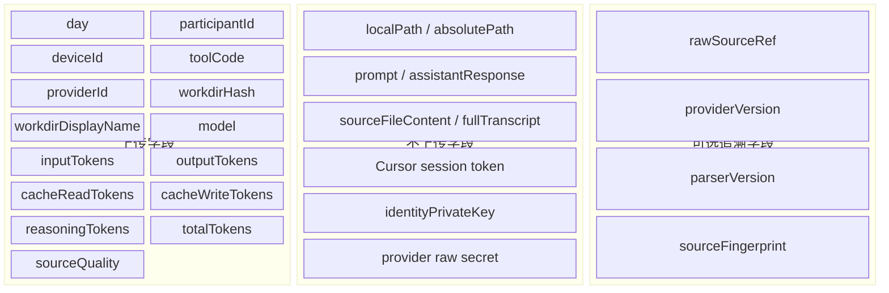

# AI Token League v0.1 - Mermaid ER 图

Version: `0.1`
Frozen at: `2026-04-30`

本文档是 v0.1 的本地/远端数据模型图谱。后续版本如果调整存储颗粒度、主键、价格表、上传 payload 或隐私边界，应新建版本段落，不直接覆盖本图。

基于 `product-design.md` 第 12 节存储数据模型生成。

## 远端存储 ER 图

## 本地存储 ER 图

## 总体数据流

## 上云最小颗粒度

UsageDaily 上云字段（不上传的字段明确列出）：

## 表关系说明

| 表 | 主键 | 关系 |
| --- | --- | --- |
| Participant | `id` | 拥有多个 Device、Workdir、UsageDaily、UploadBatch |
| Device | `id` | 属于一个 Participant；产生多条 UsageDaily |
| Workdir | `id` | 属于一个 Participant；关联多条 UsageDaily |
| UsageDaily | `day + participantId + deviceId + toolCode + providerId + workdirId + model` | 核心事实表，所有榜单从该表聚合 |
| ModelPrice | `model` | 价格表变更后重新计算 UsageDaily.estimatedCostUsd |
| UploadBatch | `id` | payloadHash 去重，审计每次上传写入的 UsageDaily 行 |

## 存储文件映射（本地）

| 逻辑实体 | 物理文件 |
| --- | --- |
| LocalIdentityConfig | `~/.ai-token-league/config.json` |
| LocalProviderRoot | `~/.ai-token-league/config.json` |
| LocalWorkdirAlias | `~/.ai-token-league/config.json` |
| LocalProviderConfig | `~/.ai-token-league/config.json`（Cursor token 等敏感配置） |
| LocalUsageCache | Electron `userData/usage-cache.json` |
| LocalUploadQueue | `~/.ai-token-league/upload-queue.json` |
| 远端全表 | `data/db.json`（MVP JSON 存储，生产化时迁移到 PostgreSQL） |
