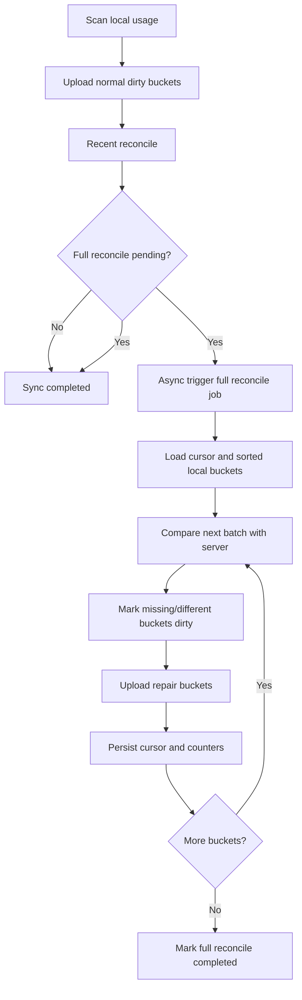

# Full Reconcile 产品与技术设计

日期: 2026-05-25

## 问题定义

AI Token League 的本地客户端保存 usage cache、upload queue 和 sync-state。服务端保存 `usage_hourly`、`usage_daily`、upload batch 记录和 sync bucket metadata。

当前普通同步依赖本地 sync-state 判断哪些 bucket 已经上传。这个判断只代表“本机认为某个 bucket 曾经对某个服务上传成功”，不能无条件代表“当前服务端仍然持有这些事实数据”。在以下场景中会出现本地与当前服务端不一致:

- 用户切换 `apiBaseUrl` 或服务端数据被重建。
- 服务端存在 `usage_hourly` / `usage_daily` 事实数据，但 sync bucket metadata 缺失。
- 旧客户端使用 daily 上传协议，新客户端使用 hourly 上传协议。
- 批量上传返回 200，但部分 bucket 未真正接受，旧客户端仍把整个 chunk 标记成功。

本设计要解决的是服务端与本地聚合数据的最终一致性问题。它不是一个用户手工修复功能。

## 成功标准

- 用户不需要理解数据比对、bucket、fingerprint、sync-state 或历史修复。
- 切换服务或当前服务端缺历史数据时，客户端能自动发现并补齐。
- 一次 full reconcile job 在进程不挂、网络可用、服务端正常时应处理完整历史，不把 250 / 500 这类 batch size 暴露为任务边界。
- 进程退出、网络中断或服务端失败后，可基于本地状态和位点恢复。
- 普通同步仍优先上传当前新增数据，且当次同步状态渲染不等待 full reconcile 完成。
- hourly 当前协议和 daily 历史协议都能安全比对。
- 服务端接口有单次请求安全上限，避免超大 payload 或 SQL 拖垮服务。

## 产品原则

### 1. 不暴露修复入口

桌面 UI 不新增“数据修复”“校验云端数据”“历史对账”按钮。

用户能看到的仍然是现有同步语义:

- 刷新
- 立即同步
- 重试同步
- 检查连接
- 更新客户端
- 已同步 / 同步中 / 云端待更新 / 需处理

Full reconcile 是同步系统内部职责。用户点击“立即同步”或后台自动同步时，如果当前服务需要 full reconcile，客户端在普通同步完成后异步触发独立任务。普通同步的完成状态不等待 full reconcile 完成。

### 2. 技术上必须有独立入口

Full reconcile 不能散落在普通 `sync_usage()` 中作为一段不可复用逻辑。它需要独立的技术入口，便于后续维护、诊断、测试和灰度策略调整。

入口分层:

| 层级 | 入口 | 面向对象 | 是否用户可见 |
| --- | --- | --- | --- |
| Rust core | `full_reconcile_usage(config, items, api_base_url, options)` | 同步编排、测试、CLI | 否 |
| CLI | `atl-collector reconcile --full` 或等价子命令 | 运维/开发诊断 | 否 |
| Tauri sidecar | `usage:full-reconcile-start/status` 或内部 command | 桌面后台任务 | 否 |
| 普通同步 | `sync_usage()` 标记并异步触发 full reconcile job | 用户常规同步 | 否 |
| 服务端 | `POST /api/usage/sync-state` 的 full mode 或独立 compare route | 客户端 job | 否 |

桌面 UI 不放按钮，但技术入口必须独立存在，避免后续把历史一致性逻辑绑死在“立即同步”按钮里。

### 3. 一次 job 尽量处理完整历史

产品意义上的一次 full reconcile job 必须跑到完整历史处理完成，除非发生 fatal error、进程退出、用户关闭应用、网络不可达或服务端失败。

内部允许分批:

```text
full reconcile job
  batch 1: compare + repair upload
  batch 2: compare + repair upload
  batch 3: compare + repair upload
  ...
  completed
```

Batch size 是 HTTP / SQL / 上传包的安全边界，不是任务边界。

## 现有事实依据

- 当前上传协议为 `/api/usage/daily-batches`，单 bucket fallback 为 `/api/usage/daily-batch`。
- 当前 snapshot mode 是 `device_day_hour_provider`，服务端写入 `usage_hourly` 后派生 `usage_daily`。
- 历史 daily 协议是 `device_day_provider`，服务端直接写入 `usage_daily`。
- `usage_daily` 是 public leaderboard、summary、admin usage、quality/detail 等页面的展示事实源。
- `usage_hourly` 是当前 hourly snapshot 的事实源和 daily 派生源。
- `usage_sync_buckets_hourly` / `usage_sync_buckets` 是幂等与对账 metadata，不是排行榜事实源。
- 现有 `/api/usage/sync-state` 已能比较客户端 bucket manifest 与服务端状态，但当前实现偏 recent window。

## 用户体验

### 普通用户可见状态

Full reconcile 运行时，不影响当次普通同步状态渲染。普通同步完成后，UI 可以显示“已同步”或“云端待更新”等常规状态；full reconcile 的运行状态由独立任务状态轮询维护。

如果产品需要提示后台正在补齐数据，只允许使用非阻塞、低优先级文案:

```text
正在后台补齐云端数据
```

不建议把 rail 主状态长时间保持为“同步中”。“同步中”只表示当前用户触发或后台触发的普通扫描/上传任务正在运行。

可接受的内部状态展示位置:

```text
设置 -> 云端 -> 同步详情
后台数据同步: 进行中 / 已完成 / 暂停后将自动继续
```

禁止展示:

- bucket
- fingerprint
- sync-state
- metadata
- full reconcile
- 数据修复
- 历史对账

### 用户操作入口

| 用户动作 | 行为 |
| --- | --- |
| 刷新 | 扫描本地数据；如云端可用，触发普通同步；如 full reconcile pending，普通同步完成后异步触发后台 full reconcile |
| 立即同步 | 上传当前 dirty bucket；如 full reconcile pending，普通同步完成后异步触发后台 full reconcile |
| 重试同步 | drain upload queue 后执行普通同步；如 full reconcile pending，普通同步完成后异步触发或恢复后台 full reconcile |
| 检查连接 | 只刷新连接状态，不直接启动 full reconcile |
| 更新客户端 | 进入更新流程 |

## 触发策略

Full reconcile 由系统自动标记 `pending`。

| 触发条件 | 处理 |
| --- | --- |
| `apiBaseUrl` 变化 | 当前服务标记 full reconcile pending |
| 当前 server identity 首次出现 | 标记 pending |
| 本地 sync-state 有历史 bucket，但当前服务没有 verified server record | 标记 pending |
| recent reconcile 发现 missing / different 比例异常 | 标记 pending |
| 恢复备份或导入身份后 | 标记 pending，避免旧同步状态误信任当前服务 |
| full reconcile failed/interrupted | 下次同步继续 |

不需要用户手工触发。

## 技术架构



普通同步和 full reconcile 的关系:

- 普通 dirty upload 优先。
- Full reconcile 是独立 job，由普通同步在完成后异步触发。
- 普通同步状态渲染不等待 full reconcile 完成。
- Full reconcile 状态通过独立 status 入口查询，不混入当次 sync result。
- Full reconcile 失败不应撤销普通 dirty upload 的成功结果。
- 同一设备同一时间只允许一个 sync/reconcile worker，避免并发写 upload queue 和 sync-state。

## Full Reconcile Job 设计

### Rust core API

建议新增独立模块，例如 `collector-core/src/reconcile.rs`。

核心入口:

```rust
pub async fn full_reconcile_usage(
    config: &AppConfig,
    items: &[serde_json::Value],
    api_base_url: &str,
    options: FullReconcileOptions,
) -> Result<FullReconcileResult, String>
```

选项:

```rust
pub struct FullReconcileOptions {
    pub batch_size: usize,
    pub upload_batch_size: usize,
    pub resume: bool,
    pub trigger: FullReconcileTrigger,
}
```

结果:

```rust
pub struct FullReconcileResult {
    pub status: FullReconcileStatus,
    pub checked_bucket_count: usize,
    pub matched_bucket_count: usize,
    pub missing_bucket_count: usize,
    pub different_bucket_count: usize,
    pub repair_uploaded_bucket_count: usize,
    pub queued_bucket_count: usize,
}
```

`sync_usage()` 只负责判断是否需要触发 full reconcile，并把任务交给独立入口。它不直接实现 full reconcile 循环，也不等待 full reconcile 作为本次同步完成条件。

### CLI 入口

建议增加隐藏或诊断型命令:

```bash
npm run collector -- reconcile --full
```

用途:

- 开发/运维对 env.test 或生产做定位。
- CI 或 smoke 使用受控样本验证 full reconcile。
- 用户支持场景中，由工程人员指导运行。

这个命令不是桌面 UI 功能，不对普通用户宣传。

### Tauri sidecar 入口

建议保留内部 command:

```text
usage:full-reconcile-start
usage:full-reconcile-status
```

用途:

- 后台自动同步可以启动独立 job。
- 桌面端主动轮询 `usage:full-reconcile-status` 获取任务状态。
- 运行状态可以进入同步详情，但不能覆盖普通同步的完成状态。
- 后续如需做后台任务观察、取消、日志导出，不需要重构普通 sync path。

桌面 UI 不放对应按钮。

### 任务状态查询

Full reconcile 状态由桌面端主动查询，不跟随当次 `sync_usage()` 返回值。

建议 status 返回:

```json
{
  "status": "idle|pending|running|failed|unrecoverable|completed",
  "trigger": "api_base_url_changed",
  "startedAt": "2026-05-25T00:00:00.000Z",
  "updatedAt": "2026-05-25T00:01:00.000Z",
  "completedAt": "",
  "checkedBucketCount": 500,
  "totalBucketCount": 683,
  "missingBucketCount": 120,
  "differentBucketCount": 0,
  "repairUploadedBucketCount": 80,
  "queuedBucketCount": 0,
  "lastError": ""
}
```

查询规则:

- 普通同步完成后，renderer 可以启动低频轮询。
- status 为 `running` 时，同步详情展示后台数据同步状态；rail 不改成长期“同步中”。
- status 为 `failed` 时，下次普通同步或后台调度自动继续；用户看到普通“需处理”状态只在普通同步/连接本身失败时出现。
- status 为 `completed` 后停止轮询。

## 本地状态设计

状态放入 `sync-state.json` 对应 server URL 下。

```json
{
  "states": {
    "https://api.example": {
      "version": 2,
      "buckets": {},
      "fullReconcile": {
        "status": "idle",
        "serverUrl": "https://api.example",
        "trigger": "api_base_url_changed",
        "cursor": {
          "lastBucketKey": ""
        },
        "startedAt": "",
        "updatedAt": "",
        "completedAt": "",
        "checkedBucketCount": 0,
        "totalBucketCount": 0,
        "matchedBucketCount": 0,
        "missingBucketCount": 0,
        "differentBucketCount": 0,
        "repairUploadedBucketCount": 0,
        "queuedBucketCount": 0,
        "lastError": ""
      },
      "verifiedServerFingerprint": ""
    }
  }
}
```

状态含义:

| status | 含义 |
| --- | --- |
| `idle` | 当前服务无需 full reconcile |
| `pending` | 已触发，等待普通同步完成后启动，或等待后台 worker 调度 |
| `running` | 正在执行 |
| `failed` | 上次失败，下次继续 |
| `unrecoverable` | 当前服务端缺 bucket，但本地事实数据已缺失，不能自动补传；不再自动重试，等待用户恢复本地数据或切换/恢复配置后重新触发 |
| `completed` | 当前服务全量校验完成 |

Cursor 使用 `lastBucketKey`，不要只用数组 index。原因是本地重新扫描后 bucket 列表可能变化，key 更稳定。

## Bucket Manifest 与协议兼容

Full reconcile 的 bucket 必须带 `granularity`。

```json
{
  "key": "2026-05-25|10|codex_local",
  "day": "2026-05-25",
  "hour": 10,
  "providerId": "codex_local",
  "granularity": "hourly",
  "fingerprint": "abc",
  "rowCount": 3,
  "totalTokens": 12345
}
```

兼容规则:

| 本地记录 | granularity | 服务端比对 |
| --- | --- | --- |
| 当前 hourly bucket，key 为 `day|hour|providerId` | `hourly` | `usage_sync_buckets_hourly`，fallback `usage_hourly` |
| 历史 daily bucket，key 为 `day|providerId` 或 snapshot mode 为 `device_day_provider` | `daily` | `usage_sync_buckets`，fallback `usage_daily` |
| 无法判断的旧记录 | `unknown_legacy` | 不自动补传，记录到 diagnostics |

不允许把 unknown legacy 当 hourly 处理，否则可能把服务端已有 daily 历史误判为缺失。

## 服务端接口

### 推荐路线

保留现有 `/api/usage/sync-state` 作为对账接口，但扩展 mode:

```json
{
  "mode": "recent|full_reconcile",
  "participantId": "p_xxx",
  "deviceId": "d_xxx",
  "clientGeneratedAt": "2026-05-25T00:00:00.000Z",
  "buckets": [],
  "signature": "..."
}
```

响应:

```json
{
  "matched": [],
  "missing": [],
  "different": [],
  "unknownLegacy": [],
  "checkedBucketCount": 250
}
```

### 单次请求上限

服务端必须设置单次请求 bucket 上限，例如 250 或 500。

这不是产品任务边界，而是接口安全边界。客户端 full reconcile job 会循环调用，直到所有历史 bucket 完成。

### 查询规则

| granularity | 优先查 | fallback |
| --- | --- | --- |
| `hourly` | `usage_sync_buckets_hourly` | 按当前 batch 从 `usage_hourly` 回算 fingerprint |
| `daily` | `usage_sync_buckets` | 按当前 batch 从 `usage_daily` 回算 fingerprint |
| `unknown_legacy` | 不查事实表 | 返回 `unknownLegacy` |

Recent mode 可以保留 35 天窗口。Full mode 不能套 35 天 cutoff，必须按客户端提交的 bucket 范围处理。

## 恢复策略

每个 batch 完成后立即持久化:

- `lastBucketKey`
- checked/matched/missing/different counters
- uploaded/queued counters
- `updatedAt`

失败处理:

| 失败点 | 处理 |
| --- | --- |
| compare 请求失败 | 不推进 cursor，status=`failed` |
| repair upload 部分失败 | 成功 bucket 更新 manifest，失败 bucket 入 upload queue，不跳过当前 batch 的未确认部分 |
| 服务端缺 bucket 但本地 facts 已彻底丢失 | status=`unrecoverable`，记录缺失 bucket，不再自动重试 |
| 进程退出 | 下次从 `lastBucketKey` 继续 |
| apiBaseUrl 变化 | 新 server URL 下重新 pending |
| bucket 列表变化 | 按排序 key 找 cursor；找不到则回退到 cursor 前最近安全位置或从头开始 |

## 性能与并发

允许一次 full reconcile 运行时间变长，但不能牺牲服务端和本地存储安全。

约束:

- Compare batch size 有上限。
- Repair upload 复用现有 `/api/usage/daily-batches` chunk 上限。
- 同一设备互斥运行 sync/reconcile。
- 普通 dirty upload 优先于 full reconcile。
- Full reconcile 运行时不占用普通同步主状态；任务进度只通过独立 status 查询进入同步详情。
- 服务端 SQL 只能查本次提交 bucket，不做 participant 全表扫描。

## 上线后观察与加固项

以下边界风险不阻塞当前 full reconcile 落地，但需要在上线后观察真实触发频率，并在证据充分时进入加固迭代。

### 跨进程写入 sync-state 的覆盖风险

当前 sync-state 写入使用临时文件加原子 rename，能避免文件半写入或 JSON 损坏。但如果桌面端 Tauri sidecar 正在后台同步或 full reconcile，同时用户在终端手动执行 CLI 诊断型 reconcile 命令，两个进程都可能读旧状态、改写各自视角下的 cursor / counters，再分别 rename 覆盖同一个 `sync-state.json`。

影响:

- 不会破坏 JSON 文件结构。
- 可能覆盖 full reconcile cursor、计数器或 `verifiedServerFingerprint` 的最新进度。
- 主要影响恢复效率，通常可由下次同步或重新 reconcile 纠正。

当前判断为低风险，原因是正常产品路径下同一设备由 sidecar 内部 worker 互斥 sync/reconcile；跨进程并发主要来自开发、运维或用户支持场景中的 CLI 手动诊断。

后续加固方向:

- 在 `sync-state.json` 读改写路径引入跨进程文件锁。
- Rust 可评估 `fd-lock` 或等价跨平台方案。
- 加锁范围应覆盖 read-modify-write，而不只是最终 rename。
- 加固前必须补 Windows / macOS 异常退出、锁等待超时、锁不可用降级策略的测试。

### Recent mode UTC cutoff 边界差异

Recent reconcile 保留 35 天窗口，cutoff day 可继续基于 UTC 计算。对于 UTC+12 / UTC-12 等极端时区用户，某些本地自然日边界可能在第 35 到 36 天附近出现 1 天候选差异。

影响:

- 只影响 recent mode 的边界 bucket 是否参与当次快速比对。
- Full reconcile mode 不套 35 天 cutoff，仍按客户端提交的完整 bucket 范围处理。
- 如果 recent mode 因边界差异漏掉历史 gap，后续 server fingerprint / missing history 触发的 full reconcile 仍会修正最终一致性。

当前判断为极低风险，原因是产品一致性目标由 full reconcile 兜底，recent mode 是快速健康检查，不是最终历史完整性边界。

后续加固方向:

- 只有当真实用户反馈显示极端时区 recent 状态误导明显时，再考虑把 recent cutoff 改为客户端明确提交的 local day window。
- 若改用本地时区窗口，必须同时定义客户端 day 语义、服务端比较语义和跨时区迁移兼容，避免把 UI 自然日和服务端 UTC day 混用。

## 验证方案

### 后端测试

- `mode=full_reconcile` 不使用 35 天 cutoff。
- `mode=recent` 继续保留 recent window。
- metadata 存在且 fingerprint 一致返回 matched。
- metadata 缺失但 hourly facts 存在且 fingerprint 一致返回 matched。
- metadata 和 facts 都缺失返回 missing。
- hourly bucket 不误查 daily facts。
- daily legacy bucket 可从 `usage_daily` matched。
- unknown legacy 返回 `unknownLegacy`，不触发 missing。
- 超过 bucket 上限返回 400。

### Rust 测试

- full reconcile 独立入口可由 sync coordinator 异步触发。
- pending / running / failed / completed 状态可恢复。
- cursor 基于 `lastBucketKey` 正确续跑。
- missing / different 会移除本地 manifest 对应 bucket 并进入 repair upload。
- 批量上传结果只确认服务端明确 accepted / duplicate / noOp 的 bucket。
- compare 失败不影响普通 dirty upload 成功。
- full reconcile 未完成时，普通 sync result 仍可返回成功，不被改写为 running/failed。

### 桌面测试

- UI 不出现 full reconcile / 数据修复 / bucket / fingerprint 文案。
- 切换 API 后，普通同步状态表现为待同步或普通同步中，不因 full reconcile 长时间占用“同步中”。
- 用户点击“立即同步”后，full reconcile pending 时在普通同步完成后异步触发。
- 桌面端可通过 `usage:full-reconcile-status` 主动查询后台任务状态。
- full reconcile 失败后，不覆盖普通同步成功状态；同步详情可显示后台数据补齐将自动重试。

### env.test 验证

用本地历史数据对 env.test 执行 full reconcile:

- 执行前，服务端缺历史天数可被识别。
- 执行后，服务端 `usage_daily` 与本地聚合总量一致。
- 已一致的最近天数不重复膨胀。
- `usage_daily` 与 `usage_hourly` 对当前 hourly 协议保持一致。

## 落地顺序

1. 扩展 sync-state 协议，支持 `mode`、`granularity`、daily/hourly 分流和请求上限。
2. 新增 Rust `full_reconcile_usage()` 独立入口和状态模型。
3. 在普通 `sync_usage()` 完成后异步触发 full reconcile job，不等待它作为当次同步结果。
4. 增加 CLI 诊断入口。
5. 增加 Tauri 内部 command/status，由桌面端主动查询任务状态；普通同步状态不被 full reconcile 覆盖。
6. 补后端、Rust、桌面测试。
7. 用 env.test 做真实数据 dry-run 和 repair 验证。

## 不做项

- 不新增用户可见的“修复数据”按钮。
- 不把 batch size 设计成一次任务只处理一小段。
- 不让服务端按 participant 全表扫描来猜客户端本地状态。
- 不把 unknown legacy 自动当 hourly 补传。
- 不让 full reconcile 的失败撤销普通 dirty upload 的成功。
- 不让 full reconcile 长时间占用普通“同步中”状态。
